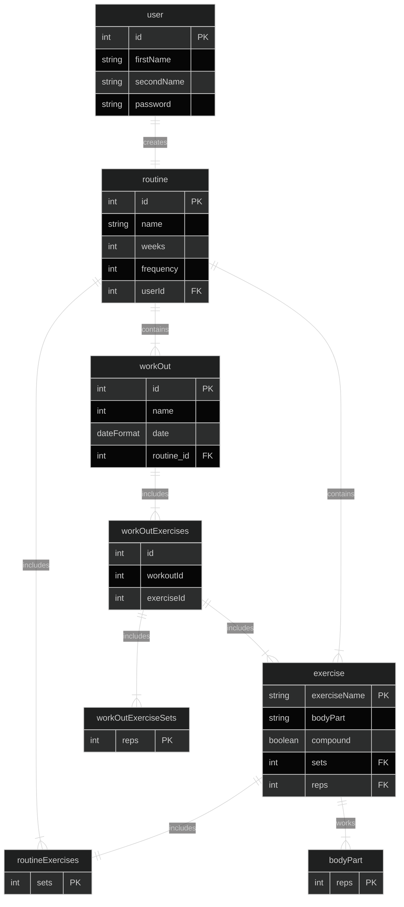

# Overview

This repositry contains an application to track and suggest gym workouts

## Problem Definition

This application is being developed to encourage users to track their workouts in order to push progress in the gym, other applications are not open source and cost too much for the service provided.

## Priorties

### Must have

- A user must be able to log in
- A user must be able to add their Routine (How many days per week, exercise selection, sets, rep range)
- A user must be able to edit this routine (edit individual workouts)

### Should have

- A user should be able to select from a set list of available exercises
- A user should be able to add new exercises if they are not on the list of exercises
- A user should have the ability to see previously logged workouts

### Could have

- The application could follow a 5/3/1 training template which will automatically increase the users lifts on a 4 week basis to encourage progression.
- The application could record your numbers and use the Brzycki formula to give an accurate 1RPM (usually only accurated between 1-10 reps)

### Will not have

- Connect to apple/android health apps
- Videos examples of how to perform exercises

## Domain Model Diagram

### Entity Relationship Diagram

